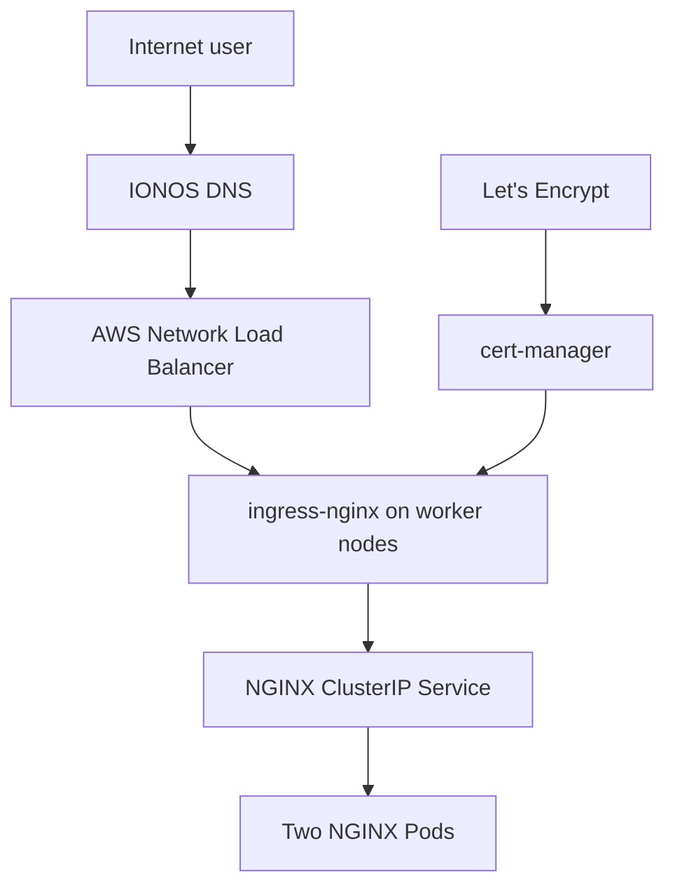

# Kubernetes Project on AWS EC2

**Author:** Robson Messias  
**Project type:** Kubernetes infrastructure and application deployment lab

## 1. Project Overview

This project implements a Kubernetes cluster on AWS EC2 with restricted role-based access control (RBAC) for deploying and administering an NGINX application. The application is publicly accessible over HTTPS through an AWS Network Load Balancer, ingress-nginx, cert-manager, and Let's Encrypt.

The project demonstrates:

- Creating a Kubernetes cluster with one control-plane node and two worker nodes.
- Bootstrapping the cluster with `kubeadm`.
- Using Flannel as the Container Network Interface (CNI).
- Deploying an NGINX workload with a restricted Kubernetes user.
- Authenticating the user with a client certificate issued through the Kubernetes `CertificateSigningRequest` API.
- Restricting the user to the `nginx` namespace through Kubernetes RBAC.
- Publishing the application through ingress-nginx and an AWS Network Load Balancer (NLB).
- Issuing and renewing the website TLS certificate with cert-manager and Let's Encrypt.
- Making the NGINX website accessible from a web browser.

> **Scope note:** This is a learning and demonstration environment. A single-control-plane kubeadm cluster does not provide production-grade control-plane high availability.

## 2. Architecture



### HTTPS request flow

```text
User
  -> IONOS DNS
  -> AWS NLB:443
  -> Worker NodePort:30443
  -> ingress-nginx
  -> Kubernetes Ingress
  -> NGINX Service
  -> NGINX Pods
```

### HTTP request flow

```text
User
  -> IONOS DNS
  -> AWS NLB:80
  -> Worker NodePort:30080
  -> ingress-nginx
  -> Redirect to HTTPS
```

TLS is terminated by ingress-nginx rather than by the NLB. The NLB listeners use TCP and forward traffic to the NodePorts exposed on the worker nodes.

## 3. Environment Inventory

### AWS infrastructure

| Component | Configuration |
| --- | --- |
| EC2 instances | Three `t2.medium` instances |
| Cluster topology | One control plane and two worker nodes |
| Load balancer | AWS Network Load Balancer |
| Target groups | TCP `80 -> 30080` and TCP `443 -> 30443` |
| Networking | Amazon VPC and Security Groups |
| DNS provider | IONOS |

### DNS configuration

| Field | Value |
| --- | --- |
| Public hostname | `nginx.ninjadevops.co.uk` |
| DNS provider | IONOS |
| Record type | CNAME |
| Host/subdomain | `nginx` |
| Target | `rob-ab34dc6fc0c14b8f.elb.us-west-1.amazonaws.com` |

### Software components

| Component | Version or configuration |
| --- | --- |
| Operating system | Ubuntu Server 26.04 LTS |
| Kubernetes | v1.36.3 |
| Cluster bootstrap | kubeadm |
| Container runtime | containerd v2.2.2 |
| CNI | Flannel, Pod CIDR `10.244.0.0/16` |
| Application image | `nginx:alpine` |
| Ingress controller | ingress-nginx |
| Certificate manager | cert-manager v1.21.1 |
| Certificate authority | Let's Encrypt through ACME HTTP-01 |

## 4. Network and Security Group Requirements

The following ports are used:

| Port | Purpose | Recommended source |
| --- | --- | --- |
| TCP 80 | Public HTTP and ACME HTTP-01 validation | Internet |
| TCP 443 | Public HTTPS access | Internet |
| TCP 22 | SSH administration | Trusted administrator IP addresses only |
| TCP 6443 | Kubernetes API access | Trusted administrator IP addresses, VPN, or private management network only |
| TCP 30080 | ingress-nginx HTTP NodePort | NLB security group or trusted VPC CIDR only |
| TCP 30443 | ingress-nginx HTTPS NodePort | NLB security group or trusted VPC CIDR only |

> **Security warning:** SSH, the Kubernetes API, and the ingress NodePorts should not be exposed to `0.0.0.0/0`. Restrict them to the smallest required source range.

The Kubernetes nodes also require full private network connectivity for control-plane, kubelet, CNI, and pod communication. The exact internal rules should be defined separately from the internet-facing rules.

## 5. Implementation

### Step 1: Create the AWS infrastructure

Create three EC2 instances for the following roles:

- One Kubernetes control-plane node.
- Two Kubernetes worker nodes.

The Kubernetes documentation requires at least 2 GiB of RAM per machine and at least two CPUs on the control-plane node. A `t3.small` technically meets those minimum requirements, but it provides limited headroom. Three existing `t2.medium` instances were therefore used for this lab.

Reference:

- [Creating a cluster with kubeadm](https://kubernetes.io/docs/setup/production-environment/tools/kubeadm/create-cluster-kubeadm/)

During EC2 instance creation, place the following bootstrap script in **Advanced details > User data - optional**:

- [ec2_kubernetes_install.sh](https://github.com/tectimerfm/Teleport/blob/main/ec2_kubernetes_install.sh)

The script installs the software required to bootstrap the Kubernetes cluster on all three EC2 instances.

#### Manually created NLB configuration

The lab uses one NLB DNS endpoint for ingress traffic. Two listeners and target groups forward traffic to the ingress-nginx NodePorts on the worker nodes:

- TCP listener `80` forwards to NodePort `30080`.
- TCP listener `443` forwards to NodePort `30443`.
- Both worker nodes are registered with the applicable target groups.

Note: Instructions for configuring the Ingress-nginx (ingress-nginx-controller) nodePorts can be found in the document referenced below, in the section "8. Creating the Nginx Ingress with Static nodePort and issuing the SSL certificate for https://nginx.ninjadevops.co.uk/".

- [3-cert-manager-letsencrypt-clusterissuer.md](https://github.com/tectimerfm/Teleport/blob/main/3-cert-manager-letsencrypt-clusterissuer.md)


### Step 2: Create the Kubernetes cluster

Follow the kubeadm and Flannel procedure in:

- [1-kubernetes-cluster-setup.md](https://github.com/tectimerfm/Teleport/blob/main/1-kubernetes-cluster-setup.md)

This stage initializes the control plane, configures the administrator kubeconfig, installs Flannel, and joins both worker nodes to the cluster.

### Step 3: Configure RBAC and the `nginx-user` client certificate

Follow the procedure in:

- [2-RBAC-permissions-client-certificate-nginx-user.md](https://github.com/tectimerfm/Teleport/blob/main/2-RBAC-permissions-client-certificate-nginx-user.md)

This stage:

- Creates the `nginx` namespace.
- Creates the `nginx-deployer` Role with the permissions required to manage the NGINX workload.
- Binds the role to `nginx-user`.
- Issues a Kubernetes client certificate for `nginx-user`.
- Creates a dedicated kubeconfig for the user.
- Validates the user's permissions with `kubectl auth can-i`.

The client certificate authenticates the user. The Role and RoleBinding authorize the operations that the authenticated identity can perform.

### Step 4: Configure cert-manager and Let's Encrypt

Follow the procedure in:

- [3-cert-manager-letsencrypt-clusterissuer.md](https://github.com/tectimerfm/Teleport/blob/main/3-cert-manager-letsencrypt-clusterissuer.md)

This stage installs cert-manager with cluster-administrator privileges and creates the `letsencrypt-prod` ClusterIssuer. The NGINX Ingress references the ClusterIssuer, and cert-manager completes the ACME HTTP-01 challenge through ingress-nginx.

The certificate and private key are stored in a Kubernetes TLS Secret and used by ingress-nginx to provide HTTPS.

## 6. Application Access

After all infrastructure, Kubernetes, RBAC, ingress, DNS, and certificate steps have completed successfully, the website is available at:

- [https://nginx.ninjadevops.co.uk/](https://nginx.ninjadevops.co.uk/)

Recommended validation commands:

```bash
curl -I http://nginx.ninjadevops.co.uk
curl -I https://nginx.ninjadevops.co.uk
```

The HTTP request should redirect to HTTPS, and the HTTPS request should return a successful response from the NGINX application.

## 7. Limitations of This User and Cluster Management Model

### RBAC complexity

Roles, ClusterRoles, RoleBindings, and ClusterRoleBindings can accumulate over time. Without consistent naming, ownership, documentation, and automated review, it becomes difficult to answer a basic question: who can perform which actions in the cluster?

### Privilege creep

When an operation is denied, administrators may add broader permissions instead of determining the minimum required permission. Over time, a restricted user can receive more access than originally intended.

### No native MFA for client certificates

Kubernetes X.509 client certificate authentication does not provide an MFA challenge. Possession of the certificate and its private key is normally sufficient to authenticate until the credential expires.

### Kubeconfig distribution risk

Client certificate kubeconfigs contain sensitive credentials. They must not be distributed through email, chat applications, support tickets, source-control repositories, or other insecure locations.

### Weak individual attribution when credentials are shared

If multiple people share a kubeconfig for `nginx-user`, Kubernetes audit logs identify the username but cannot reliably determine which individual performed an action.

### Private-key exposure

The private key is stored on the user's computer. Anyone who copies the kubeconfig or private key can authenticate as that user while the credential remains valid.

### Certificate revocation limitations

Deleting the original CertificateSigningRequest object does not invalidate an already issued client certificate. Risk can be reduced with short-lived certificates, individual identities, removal of the applicable RBAC binding, and secure credential rotation procedures.

### Manual infrastructure management

Manually creating NLBs, target groups, listeners, target registrations, and security rules increases operational effort and configuration drift. Recreating the environment consistently is also more difficult.

### Single control-plane dependency

The cluster contains only one control-plane node. Failure of that instance or its local etcd data can make the Kubernetes API unavailable. This design is appropriate for a lab but not for a production service requiring high availability.

## 8. Recommended AWS Architecture

For a production-oriented AWS implementation, Amazon EKS with infrastructure as code would simplify the environment and reduce the amount of infrastructure that must be maintained manually.

Terraform could manage:

- The VPC, subnets, and routing.
- Security groups.
- The EKS cluster and managed node groups.
- IAM roles and policies.
- EKS Access Entries.
- Kubernetes and Helm add-ons.
- The AWS Load Balancer Controller.
- DNS automation where appropriate.

### Recommended access-management approach

Use **EKS Access Entries**, also referred to as Cluster Access Management, to associate AWS IAM users or roles with Kubernetes permissions.

For most standard use cases, use AWS-managed EKS access policies. These policies can be scoped to the entire cluster or to specific Kubernetes namespaces.

When the predefined access policies are not granular enough, associate an access entry with one or more Kubernetes groups and bind those groups to custom Kubernetes RBAC roles.

This approach provides:

- Centralized association between AWS IAM identities and Kubernetes access.
- Integration with IAM roles and IAM Identity Center.
- The ability to enforce MFA through the AWS authentication and identity-management configuration.
- Individual identities instead of shared certificate kubeconfigs.
- CloudTrail visibility for EKS access-management changes.
- Access management through Terraform, AWS CloudFormation, or AWS CDK.
- Namespace-scoped access through EKS access-policy associations or Kubernetes RBAC.
- Easier modification and removal of access.

> **Important:** EKS Access Entries do not automatically enable MFA. MFA must be required by the IAM, role-assumption, or IAM Identity Center authentication policy used by the organization.

Official documentation:

- [Grant IAM users access with EKS Access Entries](https://docs.aws.amazon.com/eks/latest/userguide/access-entries.html)
- [CreateAccessEntry API](https://docs.aws.amazon.com/eks/latest/APIReference/API_CreateAccessEntry.html)
- [Associate access policies with access entries](https://docs.aws.amazon.com/eks/latest/userguide/access-policies.html)
- [Create an access entry using Kubernetes groups](https://docs.aws.amazon.com/eks/latest/userguide/create-k8s-group-access-entry.html)

### Automated NLB provisioning

Install the AWS Load Balancer Controller and configure the ingress-nginx **Service**, not the Deployment, as `type: LoadBalancer`.

The controller watches Kubernetes Service and Ingress resources. For a Service of type `LoadBalancer`, it can automatically create and configure an AWS NLB. Service annotations or controller-specific fields can configure the NLB scheme, target type, health checks, security groups, and other behavior.

This removes the need to manually:

- Create the NLB.
- Create listeners and target groups.
- Register worker nodes or pod IP targets.
- Keep AWS target configuration synchronized with cluster changes.

Official documentation:

- [Route internet traffic with the AWS Load Balancer Controller](https://docs.aws.amazon.com/eks/latest/userguide/aws-load-balancer-controller.html)

## 9. Final Assessment

The kubeadm-based implementation successfully demonstrates Kubernetes installation, networking, RBAC, client-certificate authentication, ingress routing, public DNS, and automated TLS certificate issuance.

It is appropriate for a technical lab and provides valuable visibility into the components that managed Kubernetes services normally abstract. For a production AWS environment, EKS, Terraform, EKS Access Entries, individual IAM identities, short-lived authentication, and automated load-balancer provisioning would provide stronger security, repeatability, availability, and operational scalability.
